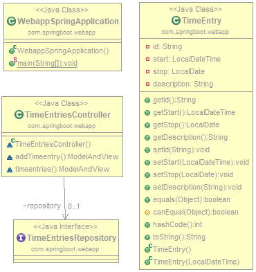
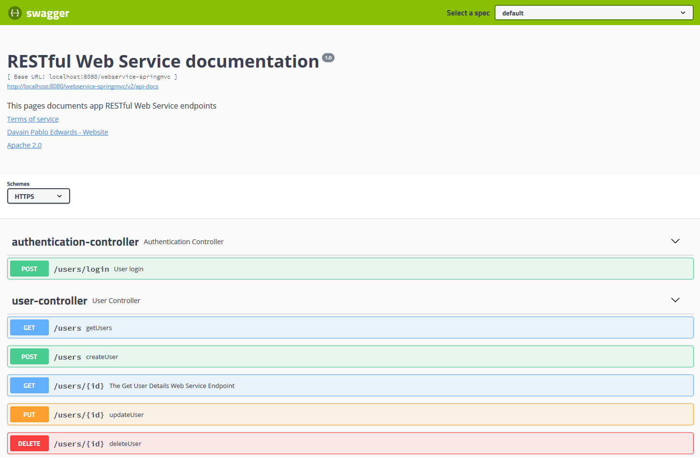

# [java-recruiting-interview]()

Demos for recruiting interview

# Demo Projects

- personmanagerlight
- webapp 

## 1) personmanagerlight Console App:

Demonstrating: 
- Console app usage
- Clean Code
- Java Doc
- [JUnit 4 Test](https://junit.org/junit4/)
- Writing & reading file 

### Screenshot

-------------------------------------------------------
### UML

-------------------------------------------------------

## 2) webapp Spring Boot App:

Demonstrating:
- [Docker](https://docs.docker.com/) usage by Dockerfile file in web app for containerization
- [Maven](https://maven.apache.org/download.cgi) POM file configuration for dependency usage
- [MongoDB](https://www.mongodb.com/download-center/community) database connection from web app
- [Spring Tool Suite (STS)](https://spring.io/tools3/sts/all) usage
- [Thymeleaf](https://www.thymeleaf.org/) rendering engine

### Screenshot

-------------------------------------------------------
### UML

-------------------------------------------------------

##### Project packages requirements:

- [Spring Boot Data MongoDB Starter](https://mvnrepository.com/artifact/org.springframework.boot/spring-boot-starter-data-mongodb) v2.1.x
- [Spring Boot Thymeleaf Starter](https://mvnrepository.com/artifact/org.springframework.boot/spring-boot-starter-thymeleaf) v2.1.x
- [Spring Boot Web Starter](https://mvnrepository.com/artifact/org.springframework.boot/spring-boot-starter-web) v2.1.x
- [Spring Boot Developer Tools](https://mvnrepository.com/artifact/org.springframework.boot/spring-boot-devtools) v2.1.x
- [Lombock](https://projectlombok.org/download) v1.18.10
- [Spring Boot Test Starter](https://mvnrepository.com/artifact/org.springframework.boot/spring-boot-starter-test) v2.1.x
- [Flapdoodle Embedded MongoDB](https://mvnrepository.com/artifact/de.flapdoodle.embed/de.flapdoodle.embed.mongo) v2.1.x
- [Spring Web](https://mvnrepository.com/artifact/org.springframework/spring-web) v2.1x
- [Spring Boot Maven Plugin](https://mvnrepository.com/artifact/org.springframework.boot/spring-boot-maven-plugin) v2.1.x

----------------------------------------------------

## 3) webservice Spring Boot MVC App:

Demonstrating:
- [H2](https://www.springboottutorial.com/spring-boot-and-h2-in-memory-database) in-memory database for webservice 
- (JUnit 5 Test](https://junit.org/junit5/)
- Password reset and Email verification features
- [Maven](https://maven.apache.org/download.cgi) POM file configuration for dependency usage
- [MySQL](https://www.mysql.com/de/downloads/) database connection for webservice
- RESTful Web Service with Spring Security Framework
- Spring Data JPA Native SQL Queries
- Spring Data JPA Query Methods
- [Spring Tool Suite (STS)](https://spring.io/tools3/sts/all) usage
- [Swagger API Doc]()
- User Sign-up functionality
- Token-based Authentication

### Screenshot

-------------------------------------------------------
### UML

-------------------------------------------------------

##### Project packages requirements:

- [AWS SDK For Java](https://mvnrepository.com/artifact/com.amazonaws/aws-java-sdk)
- [H2 Database Engine](https://mvnrepository.com/artifact/com.h2database/h2)
- [Jackson Dataformat XML](https://mvnrepository.com/artifact/com.fasterxml.jackson.dataformat/jackson-dataformat-xml) v2.1.x
- [Jason Web Token Support For The JVM](https://mvnrepository.com/artifact/io.jsonwebtoken/jjwt) v.0.9.x
- [JAXB API](https://mvnrepository.com/artifact/javax.xml.bind/jaxb-api)
- [JUnit Jupiter Engine](https://mvnrepository.com/artifact/org.junit.jupiter/junit-jupiter-engine) v.2.1.x
- [ModelMapper](https://mvnrepository.com/artifact/org.modelmapper/modelmapper) v.2.0.0
- [MySQL](https://mvnrepository.com/artifact/mysql/mysql-connector-java) v2.1.x
- [Spring Boot Developer Tools](https://mvnrepository.com/artifact/org.springframework.boot/spring-boot-devtools) v2.1.x
- [Spring Boot Test Starter](https://mvnrepository.com/artifact/org.springframework.boot/spring-boot-starter-test) v2.1.x
- [Springfox Swagger2](https://mvnrepository.com/artifact/io.springfox/springfox-swagger2) v2.9.x
- [Spring Web](https://mvnrepository.com/artifact/org.springframework/spring-web) v2.1x
- [Spring Boot Maven Plugin](https://mvnrepository.com/artifact/org.springframework.boot/spring-boot-maven-plugin) v2.1.x

---

## Credits

### Creator

**Davain Pablo Edwards**

- <https://soon.com>
- <https://github.com/dpedwards>

### Environment requirements

- [Eclipse](https://www.eclipse.org/downloads/)
- [Apache Maven](https://maven.apache.org/download.cgi)

---
